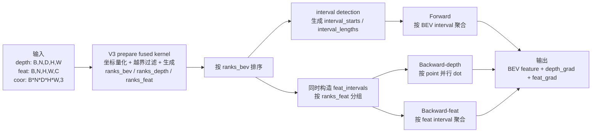
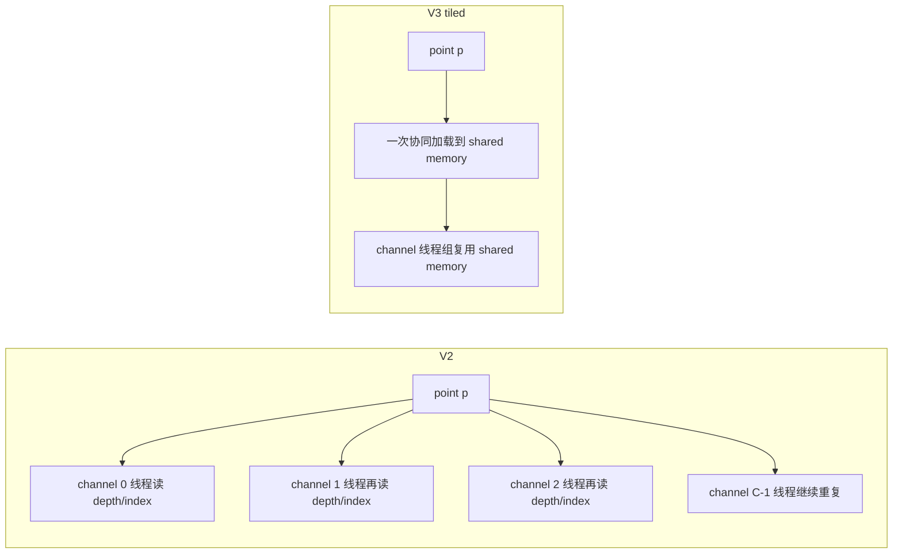
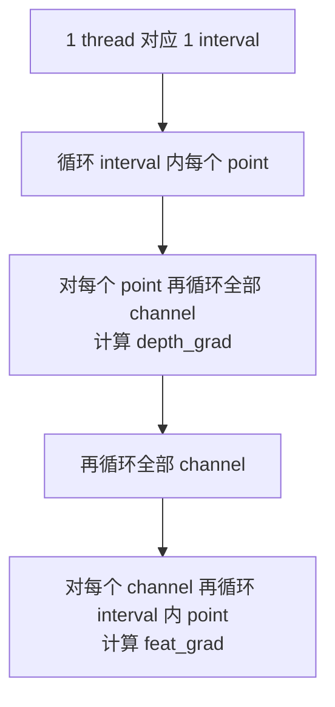
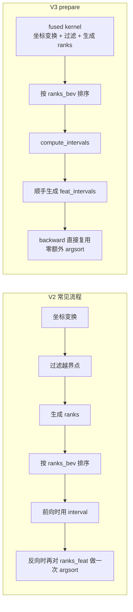
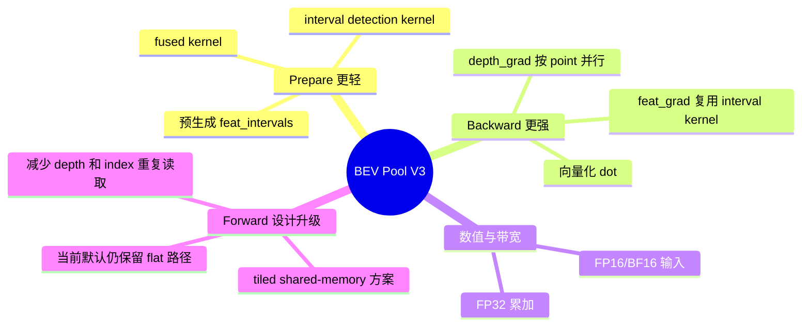

# BEV Pool V3 算法示意图

面向源码：
- V3 CUDA 主实现：[projects/mmdet3d_plugin/ops/bev_pool_v3/src/bev_pool_v3_cuda.cu](../projects/mmdet3d_plugin/ops/bev_pool_v3/src/bev_pool_v3_cuda.cu)
- V3 prepare：[projects/mmdet3d_plugin/ops/bev_pool_v3/voxel_pooling_prepare_v3.py](../projects/mmdet3d_plugin/ops/bev_pool_v3/voxel_pooling_prepare_v3.py)
- V2 对照实现：[projects/mmdet3d_plugin/ops/bev_pool_v2/src/bev_pool_cuda.cu](../projects/mmdet3d_plugin/ops/bev_pool_v2/src/bev_pool_cuda.cu)

核心计算不变：

```text
out[bev, c] = sum_{p in same BEV cell} depth[p] * feat[p, c]
```

V3 的主要变化不在数学公式，而在于：
- `prepare` 阶段把更多索引整理工作提前做完
- `backward` 被拆成更适合 GPU 并行的两条路径
- 支持 FP16 / BF16 输入，内部用 FP32 累加
- 保留了 block-per-interval 的 tiled kernel 设计

注意：
- 当前源码中的 `use_tiled(c)` 返回 `false`，所以常见配置下 forward / feat backward 默认走 `flat kernel`
- 也就是说，V3 文件里同时包含 “优化版 tiled 设计” 和 “当前默认启用的 flat 路径”

## Matplotlib 版

已导出图像：
- [PNG](/desay120T/ct/dev/uid01954/FlashOCC1.5/doc/figures/bev_pool_v3_algorithm_overview.png)
- [SVG](/desay120T/ct/dev/uid01954/FlashOCC1.5/doc/figures/bev_pool_v3_algorithm_overview.svg)
- 生成脚本：[generate_bev_pool_v3_diagram.py](/desay120T/ct/dev/uid01954/FlashOCC1.5/doc/figures/generate_bev_pool_v3_diagram.py)


## Matplotlib PPT 中文版

已导出图像：
- [PNG](/desay120T/ct/dev/uid01954/FlashOCC1.5/doc/figures/bev_pool_v3_algorithm_ppt_cn.png)
- [SVG](/desay120T/ct/dev/uid01954/FlashOCC1.5/doc/figures/bev_pool_v3_algorithm_ppt_cn.svg)
- 生成脚本：[generate_bev_pool_v3_ppt_cn.py](/desay120T/ct/dev/uid01954/FlashOCC1.5/doc/figures/generate_bev_pool_v3_ppt_cn.py)


## 1. 整体数据流



## 2. V2 vs V3 前向聚合

### V2：每个 `(interval, channel)` 一个线程

```mermaid
flowchart TB
    subgraph V2[V2 forward kernel]
        A1[线程 idx]
        A2[拆成 interval_id 和 channel_id]
        A3[串行遍历 interval 内所有 point]
        A4[每次都从全局内存读取<br/>depth[ranks_depth[p]]<br/>feat[ranks_feat[p], channel]]
        A5[累加 psum]
        A6[写回 out[bev, channel]]
        A1 --> A2 --> A3 --> A4 --> A5 --> A6
    end
```

V2 的代价：
- 同一个 point 的 `depth` 和索引，会被不同 channel 线程重复读取
- 当 `C` 较大时，重复的全局内存访问明显增多

### V3：源码包含两条前向路径

```mermaid
flowchart TB
    S{use_tiled(c)?}
    S -->|是| T1
    S -->|否，当前默认| F1

    subgraph TILED[V3 tiled path: 设计上的主要优化]
        T1[1 block 对应 1 interval]
        T2[按 TILE_K 分块处理 point]
        T3[协同加载到 shared memory<br/>s_depth / s_fidx]
        T4[线程按 channel 分工<br/>在寄存器 acc 中累加]
        T5[共享一份 depth 和 index<br/>避免被 C 个线程重复读]
        T1 --> T2 --> T3 --> T4 --> T5
    end

    subgraph FLAT[V3 flat path: 当前默认运行路径]
        F1[仍是 interval-channel 展开]
        F2[逻辑与 V2 前向接近]
        F3[作为 practical C<=512 的默认路径]
        F1 --> F2 --> F3
    end
```

前向层面的改进点：
- V3 文件中新增了 `bev_pool_v3_tiled_kernel`
- 其核心思想是把 `depth` 和 `input_idx` 先搬到 shared memory，再让多个 channel 线程复用
- 这样每个 point 的索引和深度不再被 `C` 次重复从全局内存读取
- 但当前调度策略下，常见场景默认仍使用 `flat kernel`

## 3. 为什么 tiled 路径比 V2 更省带宽



一句话概括：
- V2 是“每个 channel 自己把 point 元数据再读一遍”
- V3 tiled 是“先把 point 元数据搬进片上缓存，再让所有 channel 共享”

## 4. V2 vs V3 反向传播

### V2 backward：一个 kernel 里串行做两件事



V2 的问题：
- `depth_grad` 和 `feat_grad` 混在同一个 kernel 中
- 单线程负责一个 interval，内部双重循环较长
- 并行粒度偏粗，向量化空间有限

### V3 backward：拆成两条更适合 GPU 的路径

```mermaid
flowchart LR
    subgraph D[V3 depth backward]
        D1[1 thread 对应 1 point]
        D2[直接取出 out_grad[bev_i,:] 和 feat[feat_i,:]]
        D3[做向量化 dot<br/>float4 / half2 / bf16x2]
        D4[写入 depth_grad[dep_i]]
        D1 --> D2 --> D3 --> D4
    end

    subgraph F[V3 feat backward]
        F1[按 ranks_feat 预先分组]
        F2[复用 interval 聚合 kernel]
        F3[sum out_grad * depth]
        F4[写入 feat_grad]
        F1 --> F2 --> F3 --> F4
    end
```

V3 的改进：
- `depth_grad` 单独拆成 point-level 并行，吞吐更高
- `depth backward` 支持 `float4` / `half2` / `bf16` 向量化 dot
- `feat_grad` 不再和 `depth_grad` 混在一个大 kernel 中
- `feat backward` 直接复用 interval 聚合框架，代码路径更统一

## 5. Prepare 阶段相对 V2 的改进



Prepare 层面的收益：
- 多个 PyTorch 小操作被合并为更少的 GPU 步骤
- `feat_intervals` 在 prepare 阶段一次性生成
- backward 不必每次重新 `argsort(ranks_feat)`

## 6. 建议在汇报里强调的“V3 相比 V2 的改进”



## 7. 一页 PPT 可直接使用的结论

- V2 的瓶颈主要来自重复的全局内存访问和 backward 中过粗的并行粒度
- V3 将优化重点放在 `prepare` 和 `backward`，同时引入了 shared-memory tiled forward 设计
- 即使当前默认前向路径仍偏保守，V3 依然通过 `feat_intervals` 预计算、depth backward 向量化和低精度输入支持，显著改善了整体执行结构
- 如果后续想进一步强调前向收益，可以基于实际 `C` 和 interval length 重新开启或调参 `use_tiled(c)`
